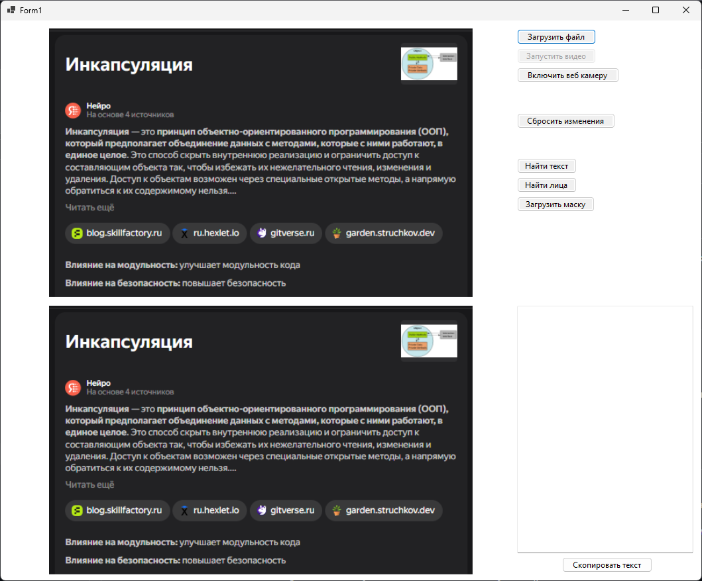
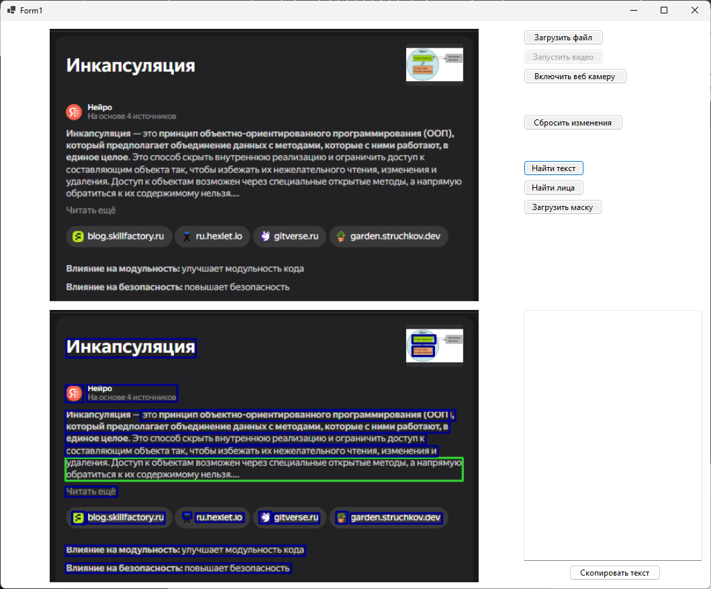
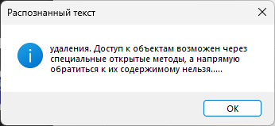
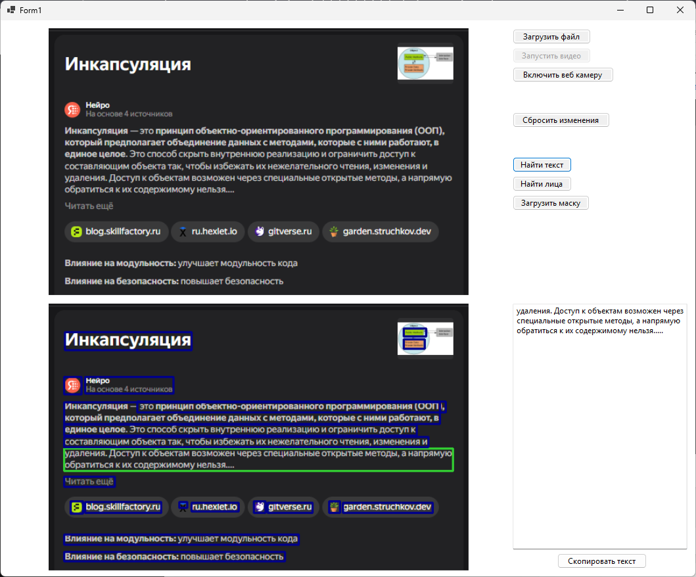
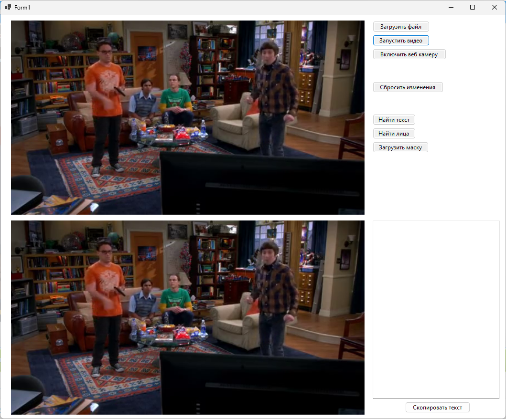
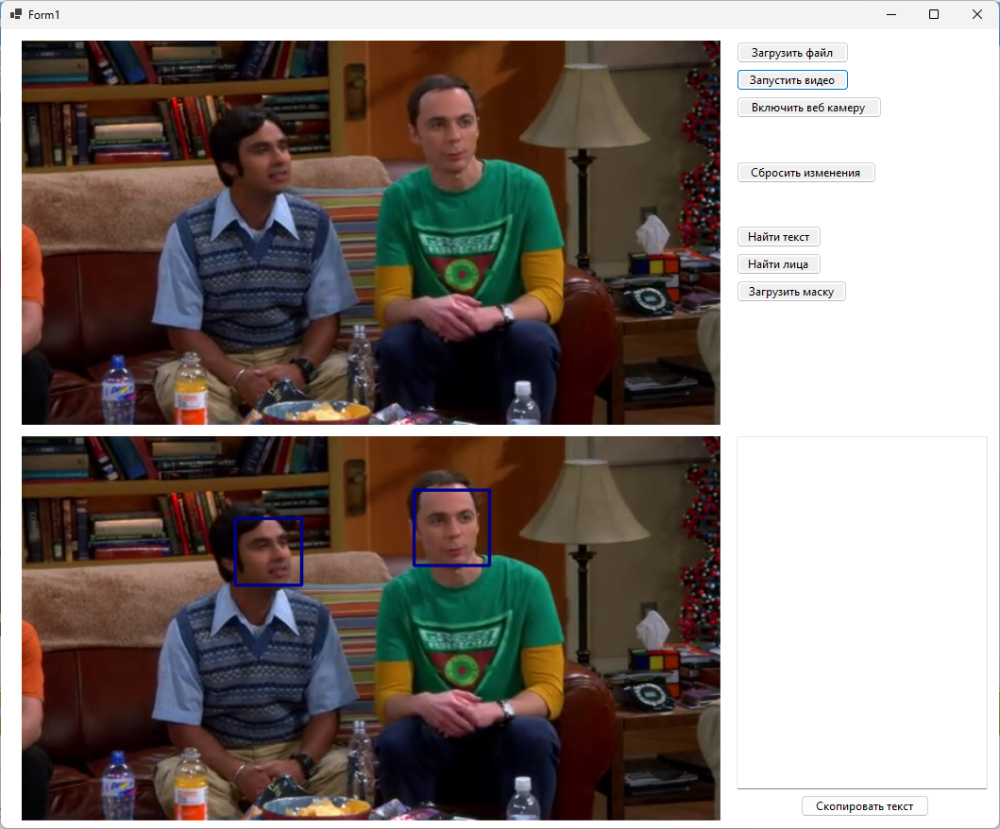
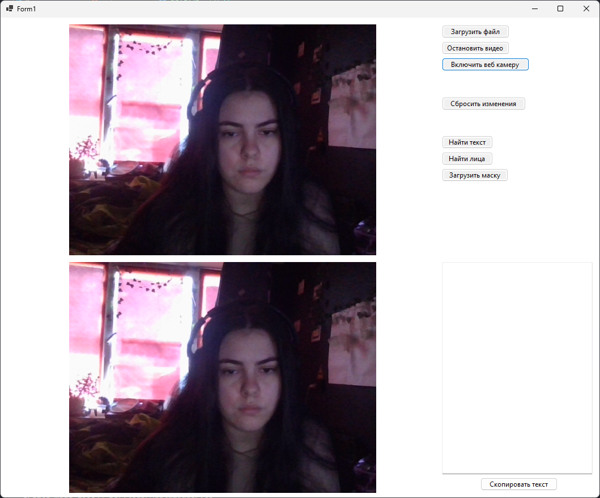
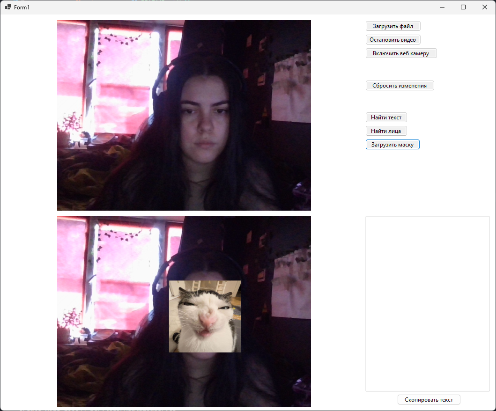

# Цель работы: 
Целью данной работы является изучение методик поиска текста и лиц на изображениях.

# Основные задачи:
Необходимо разработать приложение Windows Forms способное осуществлять: 
1.	Обнаружение и распознание текста. 
2.	Обнаружение лиц в видео потоке.

# Задание:
Реализовать программное средство, позволяющее отображать в одном окне два изображения, “оригинальное” слева и “результат обработки” справа. Реализовать интерфейс, позволяющий по нажатию на соответствующие кнопки выполнять следующие операции: 
1.	Выделение участков изображения, потенциально содержащих текст. 
2.	Выбор и отображение участка изображения. 
3.	Получение текста, содержащегося на выбранном участке изображения. 
4.	Получение текста с видео потока. 
5.	Обнаружение и обозначение лиц на видео потоке. 
6.	Наложение “масок” на найденные в видеопотоке лица.

# Результат:
1. Видео и фото загружаются с одного диалогового окна + есть захват видео с веб камеры
2. Реализовано обнаружение и распознание текста
3. Реализован поиск лиц и наложение на них масок (фотографий, загруженных пользователем)

## Обнаружение и распознание текста + загрузка фото:
Загружено фото

  

Текст обнаружен (выделен регион, куда наведен курсор)

  

Текст распознан

  

Текст вынесен в текстбокс с возможностью копирования в буфер

  

## Обнаружение лиц + загрузка видео
Загружено видео

  

Лицо обнаружено

  

## Наложение масок + видео с веб камеры
Включена веб камера

  

Маска наложена

  

